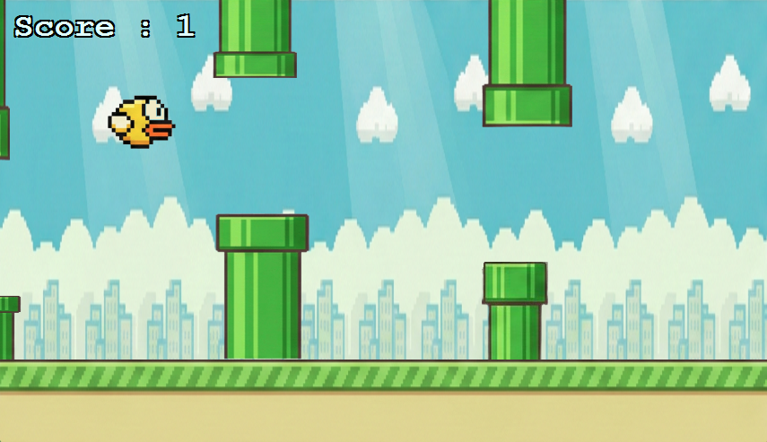

# 🐦 Flappy Bird - C# Windows Forms

This project is a simple **Flappy Bird clone** developed using **C# and Windows Forms**. The player controls a bird and tries to pass through pipes to increase their score.

## 🎮 Game Mechanics

* The bird constantly **falls due to gravity**
* The player can make the bird **jump using the keyboard**
* Pipes continuously move from **right to left**
* Each successful pass between pipes **increases the score**
* The game **ends if the bird hits a pipe or the ground**

## ⚙️ Technologies Used

* **C#**
* **.NET (Windows Forms)**
* **Visual Studio**
* **Timer-based game loop**
* **PictureBox for sprite management**

## 📁 Project Structure

```
FlappyBird/
│
├── FlappyBird/
│   ├── Form1.cs                # Game logic
│   ├── Form1.Designer.cs       # UI components
│   ├── Program.cs              # Application entry point
│   └── Properties/             # Resource files
│
└── FlappyBird.sln              # Visual Studio solution file
```

## 🕹️ Controls

| Key   | Action              |
| ----- | ------------------- |
| Space | Makes the bird jump |

## 🚀 How to Run

1. Clone the repository:

```bash
git clone https://github.com/username/FlappyBird.git
```

2. Open the project with Visual Studio:

```
FlappyBird.sln
```

3. Run the project:

```
F5
```

## 🧠 Game Logic

The game is built on the following core mechanics:

* **Gravity system:** The bird continuously accelerates downward.
* **Jump mechanic:** When the player jumps, a negative velocity is applied.
* **Pipe system:** Pipes are repositioned with random heights.
* **Collision detection:** The game checks collisions between the bird and pipes.
* **Score system:** The score increases after each successful pass.

## 📸 Game Features

* Basic physics system
* Timer-based game loop
* Random pipe generation
* Score system
* Collision detection

## 📌 Possible Improvements

You can extend this project by adding:

* Sound effects
* High score system
* Main menu screen
* Restart functionality
* Improved sprite animations

## 📸 Gameplay


